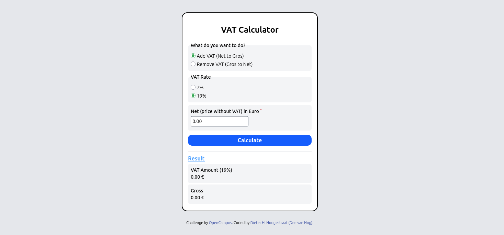

# VAT Calculator

This is a solution to the [OpenCampus' WebDev Program 2025's (a.k.a. 'The crazy one')](https://edu.opencampus.sh/en) VAT calculator challenge.  

## Table of contents

- [Screenshot](#screenshot)
- [Links](#links)
- [Built with](#built-with)
- [Author](#author)

### Screenshot

### Links

- Solution URL:[ https://github.com/vanhog/ocwebdev_ac_vatapp](https://github.com/vanhog/ocwebdev_ac_vatapp)
- Live Site URL: [https://dees-ocwebdev-vat-app.netlify.app/](https://dees-ocwebdev-vat-app.netlify.app/)

### Built with

- Semantic HTML5 markup
- CSS custom properties
- Tailwindcss
- Flexbox
- CSS Grid
- Mobile-first workflow

## Author

- Website - [Dieter H. Hoogestraat (dee van hog)](https://www.hoogestraat.com)
- Github - [@vanhog](https://github.com/vanhog)
